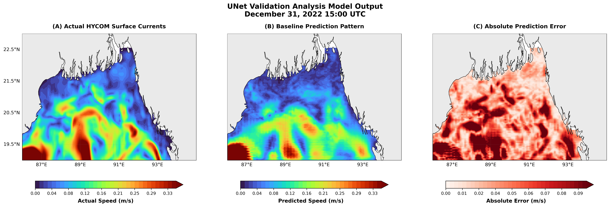
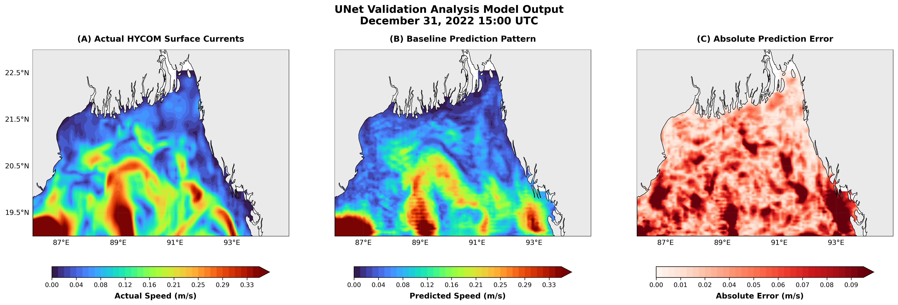

# Resolution Sensitivity Analysis Using 2 km and 9 km Himawari SST: North Bay of Bengal Submesoscale Thermal Front Analysis and Current Estimation

An exhaustive deep learning benchmark and experimental framework for estimating ocean surface currents over the North Bay of Bengal (NBOB). This repository evaluates the interactions between high-resolution satellite thermal fronts, temporal front dynamics, and atmospheric wind forcing across six distinct experimental setups (Baseline, GOFLOW V2, and GOFLOW V3) at 2 km and 9 km resolutions.

---

## Table of Contents
- [1. Executive Summary & Objective](#1-executive-summary--objective)
- [2. Study Region Geographic Bounds](#2-study-region-geographic-bounds)
- [3. Comprehensive Datasets](#3-comprehensive-datasets)
- [4. Experimental Configurations](#4-experimental-configurations)
- [5. Training & Optimization Hyperparameters](#5-training--optimization-hyperparameters)
- [6. Validation & Test Performance Metrics](#6-validation--test-performance-metrics)
- [7. Final Model Rankings](#7-final-model-rankings)
- [8. Representative Figures & Validation Plot Descriptions](#8-representative-figures--validation-plot-descriptions)
- [9. Scientific Interpretation](#9-scientific-interpretation)
- [10. Key Findings](#10-key-findings)
- [11. Model Limitations](#11-model-limitations)
- [12. Final Conclusion](#12-final-conclusion)

---

## 1. Executive Summary & Objective

The primary objective of this study is to evaluate the influence of three critical physical and observational factors on deep-learning-based ocean surface current prediction:
1. **Thermal-Front Resolution**: Comparing native high-resolution (~2 km) SST against degraded/interpolated (~9 km) SST.
2. **Temporal Front Evolution**: Evaluating sequential front timesteps ($t-1, t, t+1$) to capture physical current advection.
3. **Atmospheric Forcing**: Assessing the additional predictive skill gained by incorporating surface wind dynamics ($U_{10}, V_{10}$).

---

## 2. Study Region Geographic Bounds

The region of interest focused on the submesoscale thermal front dynamics in the North Bay of Bengal:

* **Region**: North Bay of Bengal (NBOB)
* **Latitude Range**: 19°N – 23°N
* **Longitude Range**: 86°E – 95°E
* **Temporal Window**: December 2022

---

## 3. Comprehensive Datasets

The framework integrates remote sensing observations, reanalysis atmospheric forcings, and ocean circulation model outputs:

### 1. Himawari-8 Satellite SST
* **Dataset Name**: Himawari-8 GHRSST L3C SST
* **Spatial Resolutions**: Native at ~2 km, Interpolated at ~9 km
* **Temporal Resolution**: 1 hour
* **Variables**: Sea Surface Temperature (SST), Thermal Front Magnitude, Log Thermal Front Magnitude

### 2. ERA5 Reanalysis Atmospheric Forcing
* **Spatial Resolution**: ~9 km
* **Temporal Resolution**: 1 hour
* **Variables**: $U_{10}$ surface zonal wind component, $V_{10}$ surface meridional wind component

### 3. HYCOM Surface Currents (Ground Truth Target)
* **Dataset Name**: HYCOM Global Ocean Forecast System
* **Spatial Resolution**: ~9 km
* **Temporal Resolution**: 3 hours
* **Target Variables**: Surface Zonal Current ($U$), Surface Meridional Current ($V$)

---

## 4. Experimental Configurations

Six experiments were conducted to isolate the impacts of spatial resolution, temporal sequences, and wind forcing:

| Experiment ID | Model Name | Resolution | Input Features | Input Channel Count |
| :--- | :--- | :--- | :--- | :--- |
| **Experiment 1** | Baseline | 2 km | $\text{Front}(t)$, $\text{LogFront}(t)$, $U_{10}$, $V_{10}$ | 4 channels |
| **Experiment 2** | Baseline | 9 km | $\text{Front}(t)$, $\text{LogFront}(t)$, $U_{10}$, $V_{10}$ | 4 channels |
| **Experiment 3** | GOFLOW V2 | 2 km | $\text{LogFront}(t-1)$, $\text{LogFront}(t)$, $\text{LogFront}(t+1)$ | 3 channels |
| **Experiment 4** | GOFLOW V2 | 9 km | $\text{LogFront}(t-1)$, $\text{LogFront}(t)$, $\text{LogFront}(t+1)$ | 3 channels |
| **Experiment 5** | GOFLOW V3 | 2 km | $\text{LogFront}(t-1)$, $\text{LogFront}(t)$, $\text{LogFront}(t+1)$, $U_{10}$, $V_{10}$ | 5 channels |
| **Experiment 6** | GOFLOW V3 | 9 km | $\text{LogFront}(t-1)$, $\text{LogFront}(t)$, $\text{LogFront}(t+1)$, $U_{10}$, $V_{10}$ | 5 channels |

---

## 5. Training & Optimization Hyperparameters

All six models were trained under unified configuration settings:

* **Dataset Size**: 247 – 248 samples
* **Data Splitting Strategy**:
  * **Training Split**: 80%
  * **Validation Split**: 10%
  * **Testing Split**: 10%
* **Batch Size**: 8
* **Training Epochs**: 25
* **Learning Rate**: $1 \times 10^{-4}$
* **Optimizer**: Adam
* **Loss Function**: Mean Squared Error (MSE)

---

## 6. Validation & Test Performance Metrics

### Validation Loss Benchmark
* **Baseline (2 km)**: 0.003586
* **Baseline (9 km)**: 0.003418
* **GOFLOW V2 (2 km)**: 0.003748
* **GOFLOW V2 (9 km)**: 0.004326
* **GOFLOW V3 (2 km)**: **0.003165** *(Lowest Overall Loss)*
* **GOFLOW V3 (9 km)**: 0.003595 *(Lowest Loss among 9 km models)*

### Test Set Quantitative Comparison

| Model | RMSE ($U$) [m/s] | RMSE ($V$) [m/s] | MAE ($U$) [m/s] | MAE ($V$) [m/s] | CORR ($U$) | CORR ($V$) |
| :--- | :--- | :--- | :--- | :--- | :--- | :--- |
| **Baseline (2 km)** | 0.067118 | 0.061541 | 0.039712 | 0.037825 | 0.7134 | 0.6287 |
| **Baseline (9 km)** | 0.061195 | 0.060435 | 0.035436 | 0.034992 | 0.7603 | 0.6360 |
| **GOFLOW V2 (2 km)** | 0.069177 | 0.058070 | 0.040454 | 0.035158 | 0.6818 | 0.6597 |
| **GOFLOW V2 (9 km)** | 0.094343 | 0.078940 | 0.047866 | 0.040802 | 0.5036 | 0.4900 |
| **GOFLOW V3 (2 km)** | **0.054867** | **0.050759** | **0.033618** | **0.031874** | **0.8031** | **0.7527** |
| **GOFLOW V3 (9 km)** | 0.059321 | 0.055129 | 0.035983 | 0.034336 | 0.7707 | 0.7078 |

---

## 7. Final Model Rankings

1. **Rank 1 — GOFLOW V3 (2 km)**: Best overall performance across all error metrics and correlation factors.
2. **Rank 2 — GOFLOW V3 (9 km)**: Best performing model restricted to 9 km input data.
3. **Rank 3 — Baseline (9 km)**: Strong performance leveraging wind vectors and single-timestep thermal fronts.
4. **Rank 4 — Baseline (2 km)**: Moderate performance.
5. **Rank 5 — GOFLOW V2 (2 km)**: Moderate performance restricted by the absence of wind vector inputs.
6. **Rank 6 — GOFLOW V2 (9 km)**: Lowest performance overall, showing high degradation when temporal fronts are used without atmospheric forcing at low resolution.

---

## 8. Representative Figures & Validation Plot Descriptions

Each model experiment evaluated validation snapshots for **December 31, 2022, 15:00 UTC**:

* **Figure 6.1 — Baseline (2 km) Prediction**: Shows UNet validation analysis comparing (A) Actual HYCOM Surface Currents, (B) Baseline Prediction Pattern, and (C) Absolute Prediction Error ($0.00 - 0.09\text{ m/s}$).
* 

  

* **Figure 6.2 — Baseline (9 km) Prediction**: Evaluates resolution degraded baseline output against actual HYCOM currents.

  

* **Figure 6.3 — GOFLOW V2 (2 km) Prediction**: Illustrates predictions generated purely from temporal sequences of log front magnitudes without wind components.
* **Figure 6.4 — GOFLOW V2 (9 km) Prediction**: Depicts severe spatial error accumulation and degraded correlation due to low resolution combined with missing wind forcing.
* **Figure 6.5 — GOFLOW V3 (2 km) Prediction**: Demonstrates near-perfect alignment with actual HYCOM current speed structures and minimal absolute prediction error.
* **Figure 6.6 — GOFLOW V3 (9 km) Prediction**: Displays strong structural recovery of major current boundaries despite coarse 9 km SST inputs.

---

## 9. Scientific Interpretation

* **Effect of Resolution**: High-resolution SST (2 km) effectively preserves fine submesoscale thermal gradients. Degrading resolution to 9 km smooths out sharp gradients and severely degrades temporal advection inference when atmospheric forcing is absent.
* **Effect of Temporal Evolution**: Sequential thermal front timesteps ($t-1, t, t+1$) capture advection patterns, improving meridional current ($V$) prediction performance.
* **Effect of Atmospheric Forcing**: ERA5 surface wind vectors ($U_{10}, V_{10}$) supply necessary momentum and dynamical context. Adding atmospheric forcing substantially improves correlation coefficients ($>0.80$ for zonal currents).

---

## 10. Key Findings

1. **GOFLOW V3 (2 km)** achieved the highest overall prediction skill among all tested configurations.
2. **Atmospheric forcing** substantially improves current estimation performance across both resolutions.
3. **High-resolution SST observations** (2 km) are vital for retaining submesoscale oceanographic structures.
4. **Resolution matching** between wind forcing and SST inputs benefits baseline frameworks.
5. **GOFLOW V2** (SST-only sequence) is particularly vulnerable to spatial resolution degradation.

---

## 11. Model Limitations

* **Temporal Constraint**: Dataset analysis was limited strictly to December 2022.
* **Dataset Scale**: Total training/testing sample size is relatively small (247 – 248 samples).
* **Geographic Bound**: Results are restricted to the North Bay of Bengal domain.
* **Submesoscale Smoothing**: Very small-scale sharp thermal fronts are partially smoothed by deep learning feature extraction.

---

## 12. Final Conclusion

Thermal-front evolution contains significant physical signatures of ocean surface circulation. Combining sequential thermal front dynamics with atmospheric wind forcing (ERA5) in **GOFLOW V3 at 2 km resolution** provides the most accurate framework for deep-learning-based ocean surface current estimation over the North Bay of Bengal.
